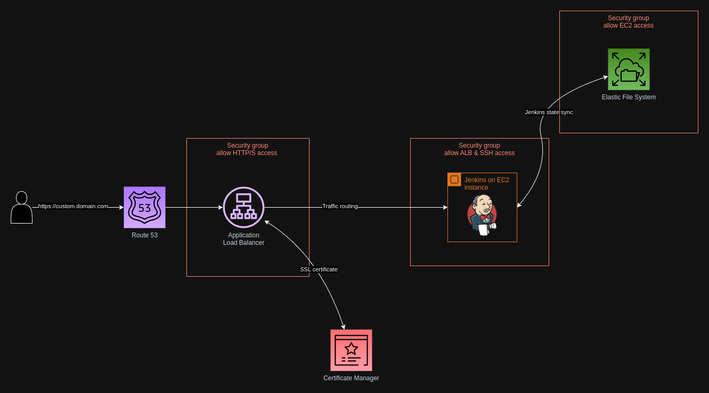

# Jenkins on AWS EC2 using Terraform

Terraform scripts that deploy a Jenkins server on an AWS EC2 instance that runs Ubuntu.

## Table of contents

- [Jenkins on AWS EC2 using Terraform](#jenkins-on-aws-ec2-using-terraform)
  - [Table of contents](#table-of-contents)
  - [Architecture diagram](#architecture-diagram)
  - [Technical choices](#technical-choices)
    - [Agents on the built-in node over controller isolation](#agents-on-the-built-in-node-over-controller-isolation)
    - [EC2 over container-based services](#ec2-over-container-based-services)
    - [Elastic File System over Elastic Block Store](#elastic-file-system-over-elastic-block-store)
    - [Ubuntu Server over Amazon Linux 2023](#ubuntu-server-over-amazon-linux-2023)
    - [Certificate Manager over certbot](#certificate-manager-over-certbot)
    - [Application Load Balancer over Apache/NGINX/nftables inside the EC2 instance](#application-load-balancer-over-apachenginxnftables-inside-the-ec2-instance)
  - [Setup](#setup)
    - [Backend](#backend)
    - [Domain](#domain)
    - [Variables](#variables)
    - [Deployment](#deployment)
    - [Jenkins server setup](#jenkins-server-setup)
    - [Repository access](#repository-access)
    - [Add your repository](#add-your-repository)
  - [Troubleshooting](#troubleshooting)

## Architecture diagram



## Technical choices

### Agents on the built-in node over controller isolation

Easiest to set up, but not recommended in the longer term as the builds have same level of access over controller file system as the Jenkins process. See more here: <https://www.jenkins.io/doc/book/security/controller-isolation/>

### EC2 over container-based services

The agents will be running Docker containers on the built-in node, so we need access to the virtual machine.

### Elastic File System over Elastic Block Store

I want to use an external file storage service to store the Jenkins state. This enables me to persist the data when I replace the instance.

One complication with EBS is that the name of the EBS device mounted on the EC2 instance can differ depending on the instance type ([source](https://docs.aws.amazon.com/AWSEC2/latest/UserGuide/device_naming.html#available-ec2-device-names)). With EFS I just have to mount the file storage system over the Network File System protocol using the DNS.

### Ubuntu Server over Amazon Linux 2023

When I was fiddling around with Amazon Linux 2023, I noticed it had some compatibility issues. For example, [you can't install on it EPEL](https://docs.aws.amazon.com/linux/al2023/ug/compare-with-al2.html#epel), an additional package repository that provides easy access to commonly-used software for the Red Hat ecosystem.

### Certificate Manager over certbot

While running certbot is trivial, Certificate Manager provides peace of mind around an important part of a web application and is [free for public certificates](https://aws.amazon.com/certificate-manager/pricing/).

### Application Load Balancer over Apache/NGINX/nftables inside the EC2 instance

It's easy to...

1) integrate Certificate Manager with ALB, and
2) set up forwarding from port 443 that gets called by the browser when accessing the URL via HTTPS to port 8080 on the EC2 instance where Jenkins is listening.

## Setup

### Backend

Configure the `backend` in the [provider.tf](./provider.tf) file, which stores the state of your infrastructure. If you decide to keep the backend in S3, remember to create the bucket beforehand; ideally, you should also enable [bucket versioning](https://docs.aws.amazon.com/AmazonS3/latest/userguide/manage-versioning-examples.html) to allow for state recovery in case of any mistakes.

### Domain

These scripts will create a subdomain in AWS, so you'll need to own a domain before running them.

Register a domain with your preferred domain registrar, then set up a hosted zone in Route 53. Replace the DNS servers configured for the domain with those from the hosted zone.

### Variables

Configure the data sources that are either fetched from the Parameter Store in [data.tf](./data.tf), and the variables passed in [variables.tf](./variables.tf).

You may want to replace the `jenkins_allow_inbound_access_from_ip` data source with one that has a list of IP addresses.

### Deployment

Preview the changes that Terraform will make to your infrastructure:

```shell
terraform plan
```

Deploy the changes:

```shell
terraform apply
```

You should now be able to access the Jenkins server in your chosen subdomain.

### Jenkins server setup

Follow the instructions on the server to set up the Jenkins server and install the recommended plugins.

### Repository access

First, we'll enable SSH access to our preferred code hosting platform. Go to `Manage Jenkins > Security > Git Host Key Verification Configuration`, select `Manually provided keys` in the `Host Key Verification Strategy`, and add the SSH key fingerprints for the hosting platform. You can find the one for GitHub here: <https://docs.github.com/en/authentication/keeping-your-account-and-data-secure/githubs-ssh-key-fingerprints>

Next, we'll set up SSH access to our repository. Go to `Manage Jenkins > Credentials > Stores Scoped to Jenkins > System > Global Credentials`, select `SSH Username with private key` in the top `Kind` select box, and input your private SSH key.

### Add your repository

Go to the `Dashboard` page and add your repository as a `Multibranch pipeline`.

## Troubleshooting

You can SSH into the server by running:

```shell
ssh ubuntu@ec2.ip.address
```

The IP address will be output as part of the `terraform apply` command. You can also fetch it by running:

```shell
terraform output
```

You'll need to add the private key that created the public key stored in the Parameter Store into your ssh-agent list.

Once you're connected, you can view the logs for the scripts that bootstrapped the server (including those from the [init.sh](./init.sh) file):

```shell
  cat /var/log/cloud-init-output.log
```
